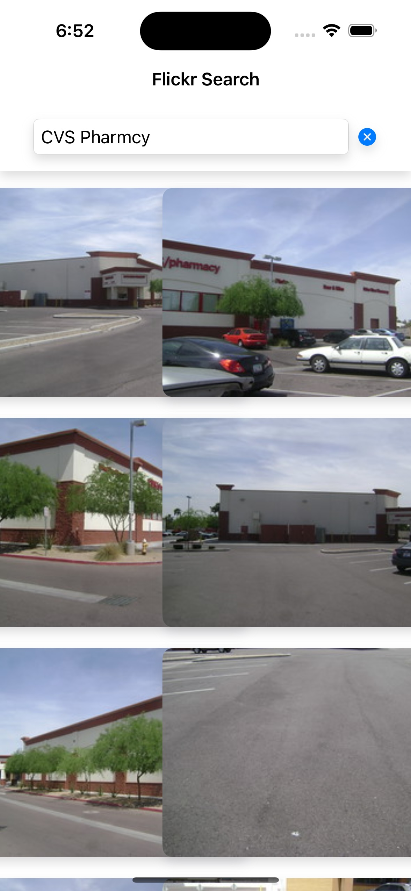

# Flickr Code Challenge

## Overview

This iOS application allows users to search for images using the Flickr API. It provides a simple and intuitive interface for searching and viewing images from Flickr.

## Features

- Search for images using keywords
- Display search results in a grid layout
- View detailed information about each image
- Responsive design that works on various iOS devices
- Accessibility support with Dynamic Text

## Technologies Used

- Swift
- SwiftUI
- Combine
- Async/Await
- MVVM Architecture

## Setup

1. Clone the repository:

git clone https://github.com/your-username/flickr-code-challenge.git

2. Open the project in Xcode:

cd flickr-code-challenge
open flickr-code-challenge.xcodeproj

3. Build and run the project in Xcode using a simulator or connected iOS device.

## Project Structure

- `flickrviewmodel.swift`: Contains the main view model for handling business logic and data flow.
- `ContentView.swift`: The main view of the application, handling user interface and interactions.
- `imagedetailview.swift`: Displays detailed information about a selected image.
- `flickrimage.swift`: Defines the data model for Flickr images.
- `fickrservice.swift`: Handles API calls to the Flickr service.

## Testing

The project includes unit tests for the `FlickrViewModel`. To run the tests:

1. Open the project in Xcode
2. Press `Cmd+U` or navigate to Product > Test

## License

This project is open source and available under the [MIT License](LICENSE).

## Contact

If you have any questions, feel free to reach out to [Sujan Kota](mailto:sujankota@gmail.com).
